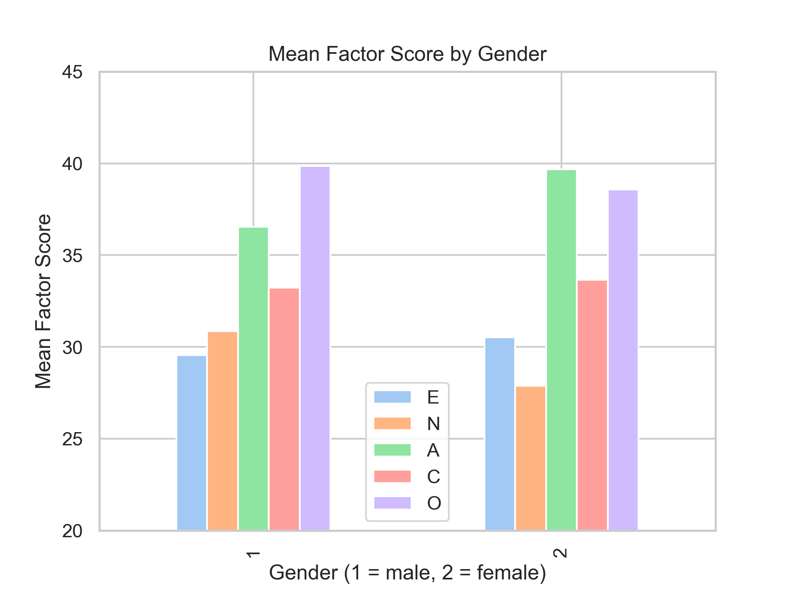
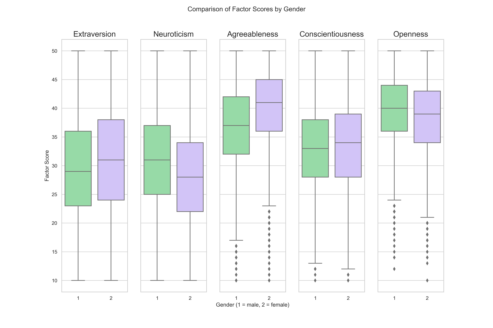
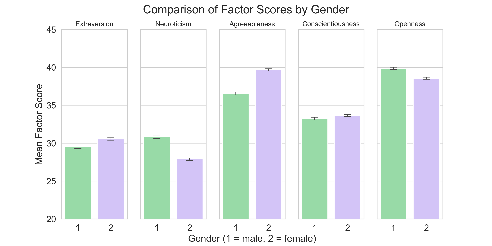

# Intro

# EDA

# Question 1 

# Questoin 2 - How do scores between males and females differ on the 5 personality factors?

## **Hypothesis**: Based on extant research, on average, females will show higher scores than men on Extraversion, and Agreeableness, lower scores on Neuroticism, and there are will be no significant gender differences for Conscientiousness or Openness.

## **Figure 1**

This plot shows the mean factor scores for each of the 5 factors, separated by gender. 

This plot is a good starting point to see roughly where there are gender differences in the data. For instance, I can see that men show higher scores than females on Openness and Neuroticism (emotional stability) while females show higher scores on Extraversion and Agreeableness. However, this plot is not the easiest to interpret since the bars for the same factor are not beside each other. Figure 4 will show side-by-side comparisons of means to make the analysis a bit easier. 

Although not a part of the research questions, I found it interesting that the pattern of scores were similar in some ways (e.g., both genders showed higher scores on Agreeableness, Conscientiousness, and Openness than Extraversion and Neuroticism (emotional stability); both genders showed the highest scores for Agreeableness and Openness. However, males showed higher scores on Neuroticism than extraversion whereas females showed higher scores on Extraversion than Neuroticism (emotional stability) and males showed higher scores on Openness than Agreeableness whereas females showed higher scores on Agreeableness than Openness. 

## **Figure 2**

Box plots showing the median (50th percentile), 25th percentile, and 75th percentile of each of the 5 factors, separated by gender. The bottom line of the box represents the 25th percentile, the middle line in the box represents the median, and the upper line of the box represents the 75th percentile. All together, the box represents the middle 50% of the data points and is referred to as the interquartile range (IQR). The lines extending from the boxes represent 1.5x the IQR and are indicative of the spread of the data -- that is, how closely clustered the individual data points are to the average. 

In this plot, the lines for Extraversion and Neuroticism extend all the way to the minimum and maximum scores, indicating a large amount of variation (i.e., spread) in the data. The plots for Agreeableness, Conscientiousness, and Openness extend to the maximum but not to the minimum. This is likely because the distribution for these factors is negatively skewed (i.e., clustered more closely to the high end of the continuum), as demonstrated in the EDA. The diamond points below the line indicate outliers in the data which are simply determined by being outside of the IQR. Based on the large sample size, skew of the data, and nature of the constructs being measured, I have chosen to keep the outliers since they are likely "true outliers" that represent natural variation in the data (e.g., it is not unreasonable that some individuals will have much lower scores on some factors than other individuals). 

This plot is useful because it gives a lot of information about the averages and distribution of the data. For instance, it can be used to compare median scores between genders which will be useful for answering the research question. 

## **Figure 3**

Bar plot showing the mean factor scores for each of the 5 factors, separated by gender. Error bars represent 98% confidence intervals. 

Compared to Figure 2, this plot makes it easier to see the differences between factor scores for each gender. It is clear that Extraversion and Neuroticism have lower average scores, and Agreeableness and Openness have higher average scores, than the other factors for both genders. When comparing between genders, the error bars representing the confidence intervals can be helpful for determining whether the difference in group means is significant -- that is, if the error bars overlap with one another, it is likely that the difference between group means is not significant. For the current research, the only factor that has error bars close to overlapping is Conscientiousness. This is in line with the hypothesis that Conscientiousness would not show significant gender differences. The other proposed null relationship was between gender and Openness -- while this factor does appear to show gender differences, the magnitude is less than that of the other 3 factors (i.e., E, N, and A). Therefore, it appears that I have support for the hypothesis that there are gender differences for the Extraversion, Neuroticism, and Agreeableness factors. 

# Question 3

# Conclusion

## Question 1

## Question 2 

Both a comparison of mean/median values and the visualizations showed consistent relationships between gender and average factor scores. However, it is difficult to draw conclusions without having more information about the sample and while conducting relatively simple analyses (e.g., visual comparison of average scores). In regard to the RQ, I believe the hypothesis is mostly supported since females show higher average scores than males on Extraversion and Agreeableness as well as lower scores on Neuroticism (i.e., lower emotional stability). Additionally, females show higher average scores than males on Conscientiousness and lower average scores on Openness, but the difference is less than for the other three factors. The only part of the analysis that revealed evidence contrary to the hypothesis was for the Openness factor -- it was hypothesized that there would not be gender differences for this factor but Figure 3 shows different mean factors scores for males vs. females and the 98% confidence interval does not overlap, suggesting a significant relationship. That being said, the difference in means for Openness was still less than the three hypothesized relationships.

## Question 3
