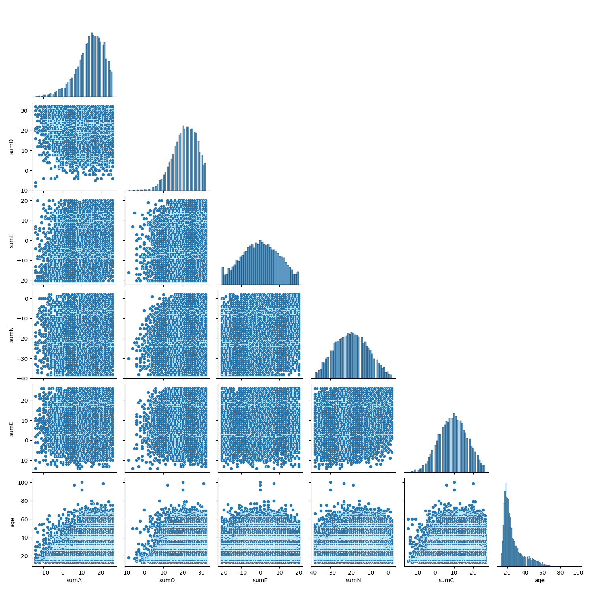
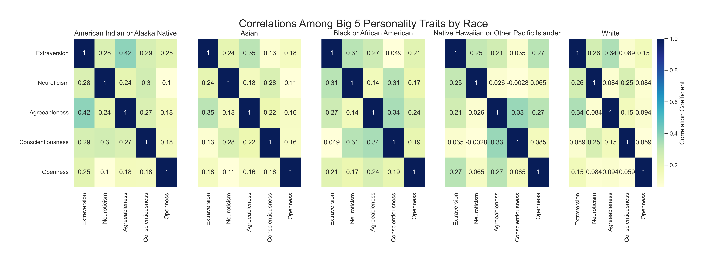
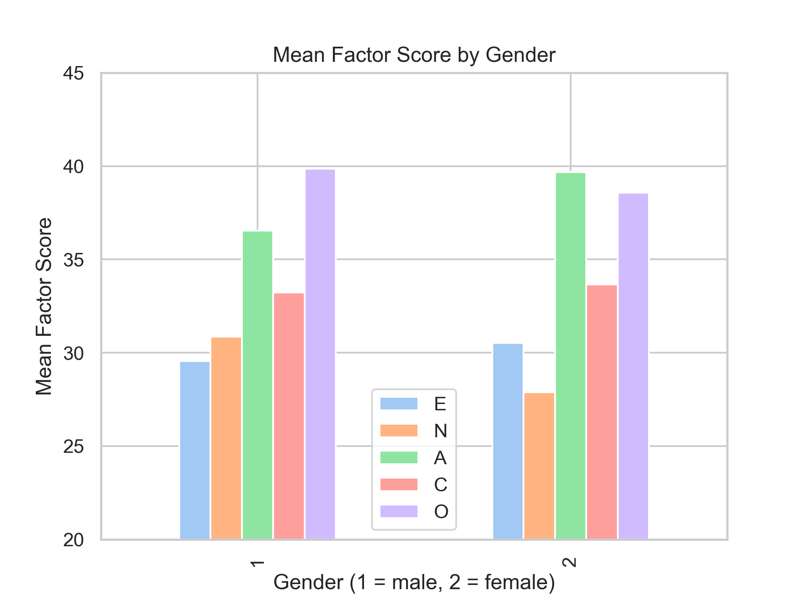
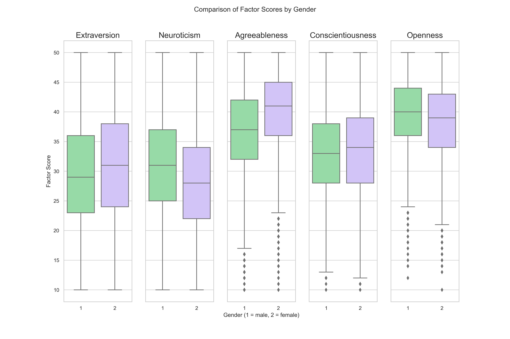
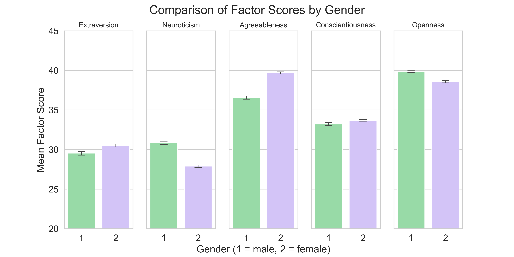

# Introduction

Our dataset consists of 19719 responses to the 5-factor personality test (AKA Big 5 personality test). The 5-Factor Personality test was developed in the 1980s after factor analysis revealed certain words/phrases used to describe personality tend to 'hang together' (i.e., there are 5 personality factors) and can be grouped to describe broad personality traits. The five factors are: Openness, Conscientiousness, Extraversion, Agreeableness, and Neuroticism. The factors are dimensional, meaning they are on a continuum, and scoring high vs. low on a certain factor is indicative of different personality traits. The survey was scored using a 5-point scale with response options 1=Disagree, 3=Neutral, 5=Agree.  

Our interests in the data relate to associations between demographic information and personality factors. In general, we are interested in psychology and personality theory and wanted to explore the potential relationships among demographic information and personality factors. 
 
 
 

# Exploratory Data Analysis (EDA)

During the exploratory data analysis phase of the project, the data was manipulated in different ways for each question because it was important for the data to reflect what was necessary to answer the specific research questions. However, there were a few main steps that were common among all group members. For starters, each member looked at the size of the overall dataset as well as what was included in this dataset, such as the column names, data types, and outliers/missing data. While looking at this it was found that there were some unanswered questions throughout the data, such as a zero for the race or gender data, or a very large number for the age data. These data were removed before the team members removed the columns they would not be needing for their respective research questions. Once the data had been cleaned and unusable data had been filtered out, each member created visualizations from their data to try to get a sense of how to answer their research questions. While looking at differences in ages vs personality traits this is one of the graphs created. 

Looking into the difference between males and females regarding personality traits, this graph was used as a starting point.

And the final question about differences in race and personality traits leads to graphs like this one.

# Question 1 - How do the 5 different personality factors change over different age groups?

The research question asked was if there was a link between age groups and their main personality factors. This interest came from wanting to see if different parenting styles that have been common during the last one hundred years could affect how a person behaves. Before looking at the data too closely it was important to note that there was not an even spread of information among the ages. The vast majority of people that participated in this survey fell between the ages of 13-30 years old, and very few individuals over the age of 70 took part. This can be seen on input line 11 of the [notebook](./notbooks/analysis1.ipynb). Keeping this fact in mind is important while moving forward to view the data.
After some analysis, it could be seen that the average scores of the personality traits were similar when compared to other age groups. 

The different scores had similar trends, mostly increasing slightly with age before dropping after the 50-59 age group. The difference in scores was a fourteen point difference between the age group 40-49 and 80-89 on the Openness factor, but since the age group 80-89 only had one data point and can be considered an anomaly, and therefore be ignored for this step. Excluding the group 80-89 the largest score difference is ten points between 60-69 and 90-100 on Neuroticism, which is only a quarter of the full forty point difference between maximum and minimum scores.
While the largest differences in average scores were for the Openness or Neuroticism traits, the traits with the bulk of scores spread out the most the Conscientiousness and Neuroticism factors. This can be seen by viewing a box plot as shown here:

This shows that there was the most real difference between ages in these factors. While there was a less significant difference among the Openness, Extroversion, and Agreeableness traits.
Overall, these data visualizations show that there is not a significant difference between people in different age groups and the main five personality factors. This data would be easier to analyze if there was an even spread of data over different age groups. A second question that would be interesting to investigate with data like this would be to see if these traits follow the same trends as shown in this analysis for an individual person throughout their life. This question would require years of data for many different people, however, so is not possible to answer with just this data.

# Question 2 - How do scores between males and females differ on the 5 personality factors?
## **Hypothesis**: Based on extant research, on average, females will show higher scores than men on Extraversion, and Agreeableness, lower scores on Neuroticism, and there are will be no significant gender differences for Conscientiousness or Openness.
 

### You can find the [full analysis notebook here](./notebooks/analysis2.ipynb), including the code and data
 

## **Figure 1**

This plot shows the mean factor scores for each of the 5 factors, separated by gender. 

This plot is a good starting point to see roughly where there are gender differences in the data. For instance, it is evident that men show higher scores than females on Openness and Neuroticism (emotional stability) while females show higher scores on Extraversion and Agreeableness. However, this plot is not the easiest to interpret since the bars for the same factor are not beside each other. Figure 3 will show side-by-side comparisons of means to make the analysis a bit easier. 

Although not a part of the research questions, I found it interesting that the pattern of scores were similar in some ways (e.g., both genders showed higher scores on Agreeableness, Conscientiousness, and Openness than Extraversion and Neuroticism (emotional stability); both genders showed the highest scores for Agreeableness and Openness. However, males showed higher scores on Neuroticism than extraversion whereas females showed higher scores on Extraversion than Neuroticism (emotional stability) and males showed higher scores on Openness than Agreeableness whereas females showed higher scores on Agreeableness than Openness. 
 
   

## **Figure 2**

Box plots showing the median (50th percentile), 25th percentile, and 75th percentile of each of the 5 factors, separated by gender. The bottom line of the box represents the 25th percentile, the middle line in the box represents the median, and the upper line of the box represents the 75th percentile. All together, the box represents the middle 50% of the data points and is referred to as the interquartile range (IQR). The lines extending from the boxes represent 1.5x the IQR and are indicative of the spread of the data -- that is, how closely clustered the individual data points are to the average. 

In this plot, the lines for Extraversion and Neuroticism extend all the way to the minimum and maximum scores, indicating a large amount of variation (i.e., spread) in the data. The plots for Agreeableness, Conscientiousness, and Openness extend to the maximum but not to the minimum. This is likely because the distribution for these factors is negatively skewed (i.e., clustered more closely to the high end of the continuum). The diamond points below the line indicate outliers in the data which are simply determined by being outside of the IQR. Based on the large sample size, skew of the data, and nature of the constructs being measured, the outliers were not removed since they are likely "true outliers" that represent natural variation in the data (e.g., it is not unreasonable that some individuals will have much lower scores on some factors than other individuals). 

This plot is useful because it gives a lot of information about the averages and distribution of the data. For instance, it can be used to compare median scores between genders which is useful for answering the research question. Based on this plot, males showed higher average scores on Neuroticism and Openness while females showed higher average scores on Extraversion, Agreeableness, and Conscientiousness. 
   

## **Figure 3**

Bar plot showing the mean factor scores for each of the 5 factors, separated by gender. Error bars represent 98% confidence intervals. 

Compared to Figure 1, this plot makes it easier to see the differences between factor scores for each gender. It is clear that Extraversion and Neuroticism have lower average scores while Agreeableness and Openness have higher average scores than the other factors, for both genders. When comparing between genders, the error bars representing the confidence intervals can be helpful for determining whether the difference in group means is significant -- that is, if the error bars overlap with one another, it is likely that the difference between group means is not significant. For the current research, the only factor that has error bars close to overlapping is Conscientiousness. This is in line with the hypothesis that Conscientiousness would not show significant gender differences. The other proposed null relationship was between gender and Openness -- while this factor does appear to show gender differences, the magnitude is less than that of the other 3 factors (i.e., E, N, and A). Therefore, it appears that the data show support for the hypothesis that there are gender differences among the Extraversion, Neuroticism, and Agreeableness factors. 
   

# Question 3 - How do scores between all races differ on the five personality factors? Furthermore, is there a relationship between personality traits and race?

## **Hypothesis**:
I hypothesized that a particular race group would show higher scores on the big five personality traits (extraversion, neuroticism, agreeableness, conscientiousness, openness) than other race group.
 

### You can find the [full analysis notebook here](./notebooks/analysis3.ipynb), including the code and data
 

## **Figure 1**
This bar plot shows the mean factor scores for each of the five personality traits, separated by race. All races show higher scores on agreeableness and openness and lower scores on extraversion and neuroticism. Scores on conscientiousness are in the middle for all races. The result indicates no differences in the big five personality traits among races, which does not support the hypothesis.
   

## **Figure 2**
This bar plot shows the mean factor scores for each of the five personality traits, separated by race. Error bars represent 98% confidence intervals. Compared to Figure 1, this plot makes it easier to see the differences between factor scores for each race. All races score similarly on each of the five personality traits. The result indicates no differences in the big five personality traits among races, which does not support the hypothesis.
   

## **Figure 3**
This plot shows Pearson's correlation coefficient among the five personality traits for each race. The darker colours represent greater magnitude of correlation. All races show a weak positive correlation or no correlation among the five personality traits.

The American Indian or Alaska Native shows the strongest correlation (r = .42) between Extraversion and Agreeableness and the weakest correlation (r = .10) between Neuroticism and Openness. Asian shows the strongest correlation (r = .35) between Extraversion and Agreeableness and the weakest correlation (r = .11) between Neuroticism and Openness. Black or African American shows the strongest correlation (r = .34) between Agreeableness and Conscientiousness and the weakest correlation (r = .049) between Extraversion and Conscientiousness. Native Hawaiian or Other Pacific Islander shows the strongest correlation (r = .33) between Agreeableness and Conscientiousness and the weakest correlation (r = .026) between Neuroticism and Agreeableness. White shows the strongest correlation (r = .34) between Extraversion and Agreeableness and the weakest correlation (r = .059) between Openness and Conscientiousness. No particular correlation between personality traits is strongest or weakest for all races.

However, all races show a stronger correlation between Extraversion and Agreeableness compared to other correlations between personality traits. Moreover, all races show a weaker correlation between Neuroticism and Openness and between Conscientiousness and Openness compared to other correlations between personality traits. The result indicates no differences in the big five personality traits among races, which does not support the hypothesis.

# Conclusion 

Looking into the five personality factors and demographic information has shown that there are not many consistent associations between the personality factors and demographics. Every individual scores differently on the 5 factors regardless of their age, sex, or race. The analysis revealed that when looking at the age groups and factor scores, the average factor scores of each age group were similar to each other. When looking at the factors and gender it was shown that, on average, males showed higher scores on Neuroticism and Openness whereas females showed higher scores on Extraversion, Agreeableness, and Conscientiousness -- however, there is lots of variability within the sample which makes it difficult to draw conclusions. Finally, while looking to see if there was a link between race and factor scores, it could be seen that the average factor scores of each race group were similar to each other.

It is important to keep in mind that much of this data was skewed by a large majority of the sample being young, white, and female. 
